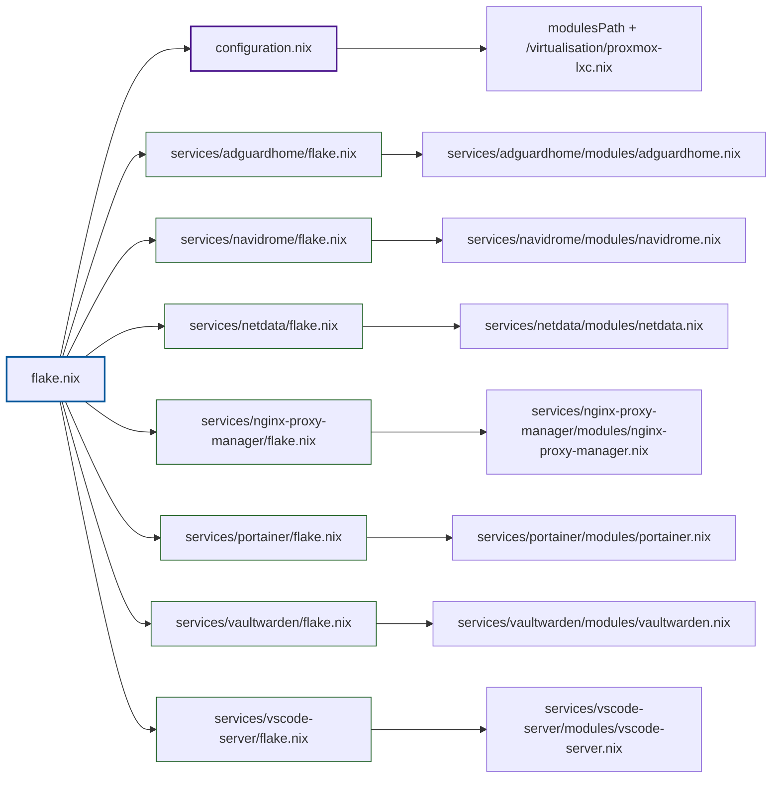

# Конфигурация NixOS для Proxmox LXC

Модульная конфигурация NixOS, разработанная специально для контейнеров Proxmox LXC, включающая коллекцию self-hosted сервисов с автоматической загрузкой модулей и управлением на основе flakes.

## 🌟 Обзор проекта

Данная конфигурация предоставляет комплексную основу для развёртывания self-hosted сервисов в контейнерах NixOS, работающих на Proxmox. Модульная архитектура позволяет легко добавлять и удалять сервисы, сохраняя чистое разделение ответственности.

### Ключевые особенности

- **Оптимизация для Proxmox LXC**: Специально настроена для контейнеров Proxmox LXC с соответствующим подавлением systemd-юнитов
- **Модульная архитектура**: Каждый сервис инкапсулирован в собственном модуле с независимой конфигурацией flake
- **Автоматическая загрузка модулей**: Динамическое обнаружение сервисов и загрузка модулей из директории services
- **Self-hosted сервисы**: Предварительно настроенные модули для популярных self-hosted приложений
- **Управление на основе flakes**: Современные Nix flakes для воспроизводимых развёртываний
- **SSH доступ**: Настроен SSH доступ для удалённого управления

## 📁 Принципиальная структура файлов

```
.
├── flake.nix                    # Основной системный flake с динамической загрузкой модулей
├── configuration.nix           # Базовая конфигурация системы для LXC
├── flake.lock                  # Lock-файл для воспроизводимых сборок
├── services/                   # Директория модулей сервисов
│   ├── _default.nix           # Утилита обнаружения сервисов
│   ├── adguardhome/           # DNS-сервис AdGuard Home
│   │   ├── flake.nix
│   │   └── modules/adguardhome.nix
│   ├── authentik/             # Сервис аутентификации Authentik (закомментирован)
│   │   ├── flake.nix
│   │   └── modules/authentik.nix
│   ├── navidrome/             # Музыкальный сервер Navidrome
│   │   ├── flake.nix
│   │   └── modules/navidrome.nix
│   ├── netdata/               # Система мониторинга Netdata
│   │   ├── flake.nix
│   │   └── modules/netdata.nix
│   ├── nginx-proxy-manager/   # Nginx Proxy Manager
│   │   ├── flake.nix
│   │   └── modules/nginx-proxy-manager.nix
│   ├── portainer/             # Управление контейнерами Portainer
│   │   ├── flake.nix
│   │   └── modules/portainer.nix
│   ├── vaultwarden/           # Менеджер паролей Vaultwarden
│   │   ├── flake.nix
│   │   └── modules/vaultwarden.nix
│   └── vscode-server/          # VSCode Server
│       ├── flake.nix
│       └── modules/vscode-server.nix
└── README.md                  # Этот файл
```

## 🗺️ Граф зависимостей файлов



## 🚀 Доступные сервисы

### DNS и сеть
- **AdGuard Home** (Порт 3000)
  - Блокировка рекламы и фильтрация DNS на уровне сети
  - Веб-интерфейс для управления
  - Порт в файрволе открывается автоматически

### Управление паролями
- **Vaultwarden** (Порт 8222)
  - Менеджер паролей, совместимый с Bitwarden
  - Self-hosted альтернатива Bitwarden
  - Настроен для доступа из сети

### Веб-прокси и SSL
- **Nginx Proxy Manager** (Порты 80, 81, 443)
  - Управление обратным прокси на базе Docker
  - Управление SSL-сертификатами через Let's Encrypt
  - Веб-интерфейс для простой настройки

### Управление контейнерами
- **Portainer** (Порт 9443)
  - Веб-интерфейс управления Docker-контейнерами
  - Визуальный мониторинг и управление контейнерами
  - Безопасный доступ по HTTPS

### Медиа и развлечения
- **Navidrome** (Порт 4533)
  - Музыкальный сервер с веб-интерфейсом
  - Настроен для монтирования сетевых шар CIFS
  - Автоматическое управление музыкальной библиотекой

### Мониторинг
- **Netdata** (Порт 19999)
  - Мониторинг системы и приложений в реальном времени
  - Обнаружение аномалий с помощью машинного обучения
  - Комплексный сбор метрик

### Разработка
- **VSCode Server**
  - Visual Studio Code на базе браузера
  - Возможности удалённой разработки
  - Интеграция с системными пакетами

## 🔧 Базовая конфигурация системы

Базовая конфигурация оптимизирована для контейнеров Proxmox LXC:

### Настройки для LXC
- Интеграция с модулем Proxmox LXC
- Поддержка привилегированных контейнеров
- Управление сетью отключено (обрабатывается Proxmox)
- Подавление systemd-юнитов для совместимости с LXC

### Конфигурация SSH
- SSH-сервер включён с доступом через файрвол
- Вход root разрешён (для управления контейнером)
- Аутентификация по паролю включена
- Пустые пароли разрешены (для первоначальной настройки)

### Возможности Nix
- Экспериментальные возможности включены: `nix-command`, `flakes`
- Nix-ld включён для совместимости бинарных файлов
- Git включён для операций контроля версий

## 🛠️ Инструкции по установке

### Предварительные требования
- Proxmox VE 7.2 или новее
- NixOS 22.05 или новее
- Доступ к CLI Proxmox (SSH или веб-консоль)

### Шаг 1: Генерация LXC шаблона

Сначала сгенерируйте NixOS LXC шаблон с помощью nixos-generators:

```bash
# Генерация LXC шаблона для Proxmox
nix run github:nix-community/nixos-generators -- --format proxmox-lxc
```

Эта команда создаст tarball с NixOS, оптимизированный для Proxmox LXC.

### Шаг 2: Загрузка шаблона в Proxmox

Скопируйте сгенерированный tarball на хост Proxmox и загрузите его как шаблон контейнера:

```bash
# Скопируйте tarball на Proxmox хост
scp nixos-system-x86_64-linux.tar.xz root@proxmox:/tmp/

# На хосте Proxmox загрузите шаблон
pveam upload local vztmpl /tmp/nixos-system-x86_64-linux.tar.xz
```

### Шаг 3: Создание LXC контейнера

Создайте новый LXC контейнер из шаблона через CLI Proxmox:

```bash
# Создание контейнера
pct create 100 local:vztmpl/nixos-system-x86_64-linux.tar.xz \
  --hostname nixos-services \
  --memory 2048 \
  --cores 2 \
  --net0 name=eth0,bridge=vmbr0 \
  --ostype unmanaged \
  --features nesting=1 \
  --privileged 1
```

**Важные параметры:**
- `--ostype unmanaged`: Необходим, чтобы Proxmox не пытался выполнять дополнительные операции с системой
- `--features nesting=1`: Включает вложенность для запуска Docker и других контейнеров внутри
- `--privileged 1`: Требуется для некоторых сервисов (Docker, systemd сервисы)

### Шаг 4: Настройка конфигурации контейнера

После создания контейнера отредактируйте его конфигурационный файл:

```bash
# Откройте конфигурационный файл контейнера
nano /etc/pve/lxc/100.conf
```

Добавьте следующие строки:

```conf
# Для NixOS 21.11 и новее
lxc.init.cmd: /sbin/init

# Для старых версий NixOS (до 21.11)
# lxc.init.cmd: /init
```

### Шаг 5: Запуск и базовая настройка контейнера

Запустите контейнер и выполните первоначальную настройку:

```bash
# Запуск контейнера
pct start 100

# Вход в контейнер
pct enter 100

# Обновление nix-каналов
nix-channel --update
nix-channel --add https://nixos.org/channels/nixos-unstable nixos

# Перезагрузка для применения обновлений
reboot
```

### Шаг 6: Установка конфигурации

После перезагрузки войдите в контейнер и установите конфигурацию:

```bash
# Вход в контейнер
pct enter 100

# Клонирование репозитория
git clone <адрес-репозитория>
cd nixos-configuration

# Применение конфигурации
nixos-rebuild switch --flake .#nixos
```

### Шаг 7: Настройка консоли (если необходимо)

Если консоль не работает, установите режим консоли в `/dev/console`:

1. В веб-интерфейсе Proxmox выберите контейнер
2. Перейдите в раздел "Configuration" → "Options"
3. Найдите "Console Mode" и установите значение `/dev/console` (вместо `tty`)

### Альтернативный метод: Использование готового шаблона

Если вы предпочитаете использовать готовый шаблон, вы можете скачать его с Hydra:

```bash
# Перейдите на https://hydra.nixos.org/project/nixos
# Выберите релиз (маленькие релизы не содержат нужный tarball)
# Откройте вкладку Jobs и найдите nixos.containerTarball
# Выберите свою архитектуру (обычно x86_64)
# Скачайте последний успешный system-tarball

# Переименуйте tarball согласно конвенции Proxmox
mv nixos-system-x86_64-linux.tar.xz nixos-24.05-default_123456_amd64.tar.xz
```

## 🛠️ Добавление новых сервисов

### Создание нового сервиса

1. **Создайте директорию сервиса:**
   ```bash
   mkdir services/new-service
   ```

2. **Создайте flake сервиса:**
   ```nix
   # services/new-service/flake.nix
   {
     inputs = {
       nixpkgs.url = "github:NixOS/nixpkgs/nixos-24.05";
     };
     outputs = { self, nixpkgs, ... }: {
       nixosModules = rec {
         default = new-service;
         new-service = import ./modules/new-service.nix;
       };
     };
   }
   ```

3. **Создайте модуль сервиса:**
   ```nix
   # services/new-service/modules/new-service.nix
   { config, pkgs, ... }: {
     # Ваша конфигурация сервиса здесь
     # Например:
     # services.my-service = {
     #   enable = true;
     #   port = 8080;
     # };
   }
   ```

4. **Обновите основной flake:**
   Сервис будет автоматически обнаружен и загружен основным flake.

## 🔧 Управление сервисами

### Включение/отключение сервисов

Для включения или отключения сервисов измените секцию `inputs` в основном `flake.nix`:

```nix
inputs = {
  nixpkgs.url = "github:NixOS/nixpkgs/nixos-24.05";
  adguardhome.url = "./services/adguardhome";
  # Закомментируйте сервисы для их отключения:
  # authentik.url = "./services/authentik";
  navidrome.url = "./services/navidrome";
  # ... другие сервисы
};
```

### Обновление конфигурации

После изменения списка сервисов примените конфигурацию:

```bash
nixos-rebuild switch --flake .#nixos
```

## 🔐 Соображения безопасности

- **SSH доступ**: Настроен для удобного управления контейнером, но должен быть защищён в production
- **Файрвол**: Каждый сервис автоматически открывает необходимые порты
- **Привилегированный контейнер**: Требуется для некоторых сервисов, но увеличивает поверхность атаки
- **Аутентификация по паролю**: Включена для удобства, но рассмотрите аутентификацию по ключам для production

## 📝 Особенности сервисов

### Navidrome
- Требует настройки сетевой шары CIFS
- Обновите IP-адрес в `fileSystems."/run/media/navidrome"` в соответствии с вашей сетью
- Права доступа к музыкальной папке управляются автоматически

### Nginx Proxy Manager
- Работает в Docker-контейнере
- Постоянное хранилище для данных и сертификатов Let's Encrypt
- Всегда загружает последний образ при перезапуске

### Vaultwarden
- API, совместимый с Bitwarden
- Настроен для доступа из всей сети
- Рассмотрите возможность добавления SSL-терминации через Nginx Proxy Manager

## 🔄 Обновление и обслуживание

### Обновление системы
```bash
nixos-rebuild switch --flake .#nixos --update
```

### Обновление flakes
```bash
nix flake update
nixos-rebuild switch --flake .#nixos
```

### Обновление конкретных сервисов
Каждый сервис может быть обновлён индивидуально путём изменения входных данных его flake или конфигурации.

## 🤝 Вклад в проект

1. Форкните репозиторий
2. Создайте ветку функции
3. Добавьте свой сервис, следуя установленному шаблону
4. Протестируйте ваш сервис в LXC контейнере
5. Отправьте pull request

## 📄 Лицензия

Эта конфигурация предоставляется как есть для образовательных и личных целей. Убедитесь в соблюдении лицензий отдельных сервисов и приложений.

## 🙏 Благодарности

- Сообщество NixOS за отличную документацию и инструменты
- Сопровождающие сервисов за предоставление модулей NixOS
- Команда Proxmox за отличную платформу виртуализации

## 📚 Полезные ссылки

- [NixOS Wiki: Proxmox Virtual Environment](https://wiki.nixos.org/w/index.php?title=Proxmox_Virtual_Environment&mobileaction=toggle_view_mobile)
- [NixOS Wiki: Proxmox Linux Container](https://wiki.nixos.org/wiki/Proxmox_Linux_Container)
- [nixos-generators](https://github.com/nix-community/nixos-generators)
- [Proxmox VE Documentation](https://pve.proxmox.com/wiki/Main_Page)